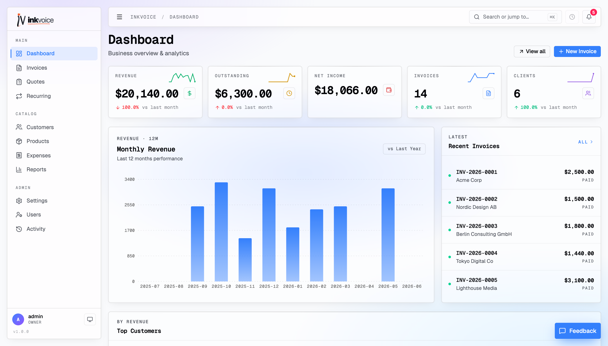
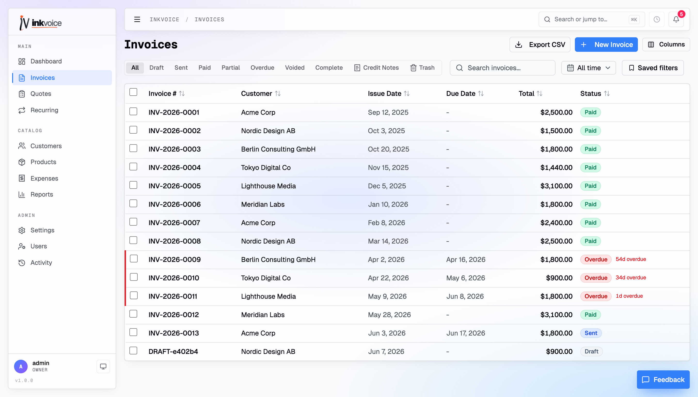
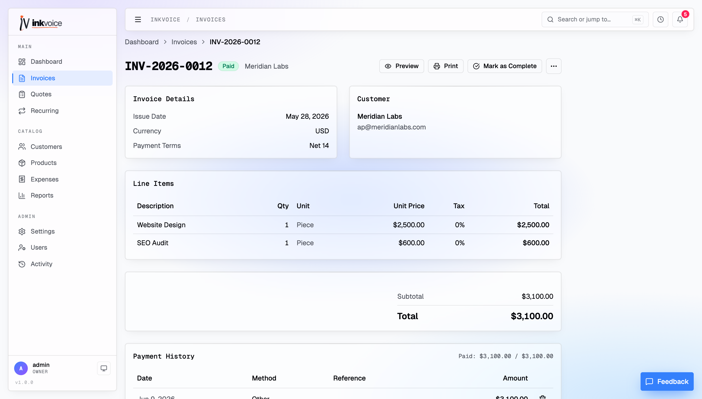
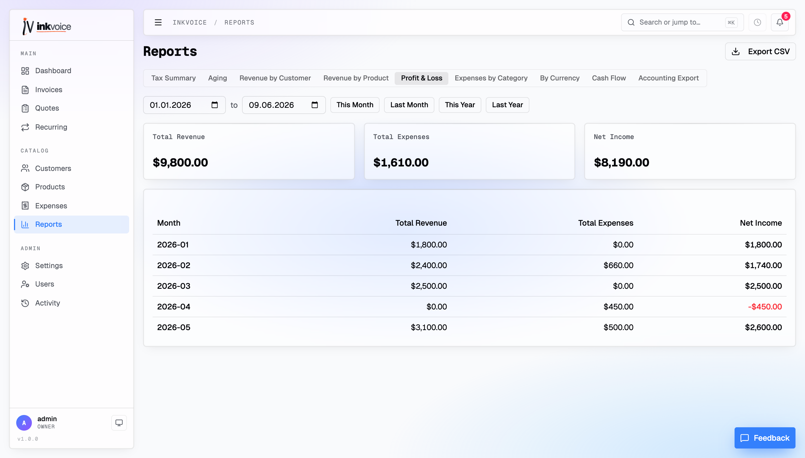
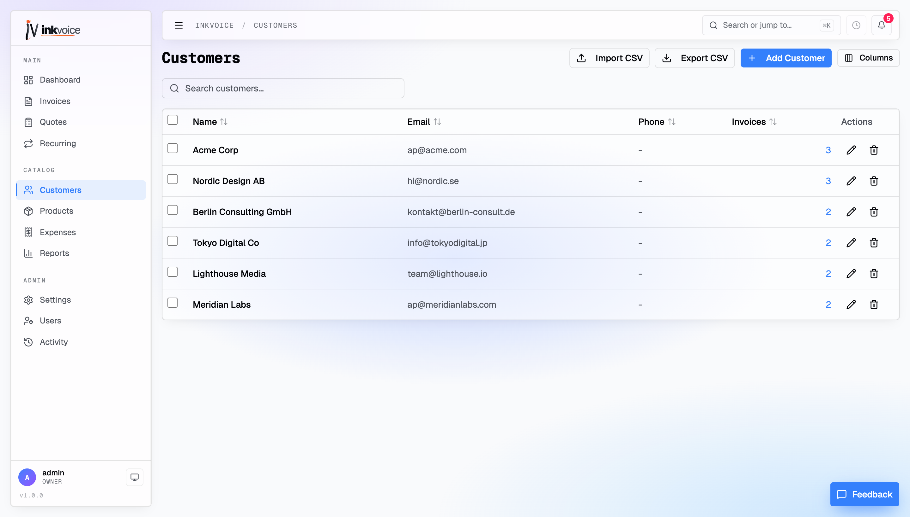
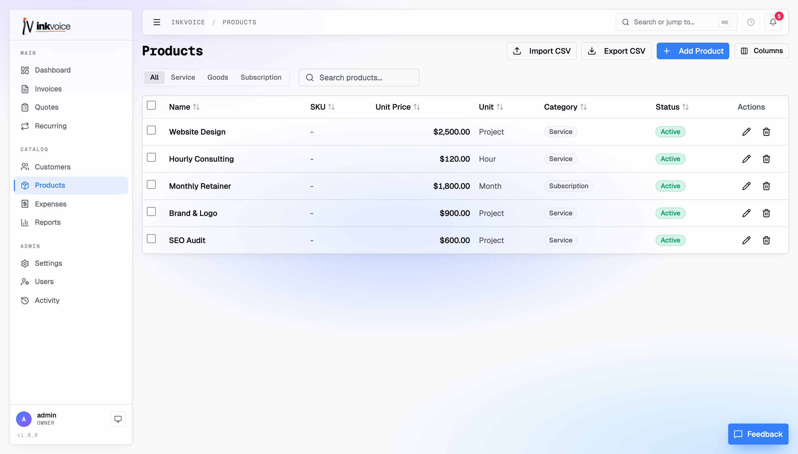
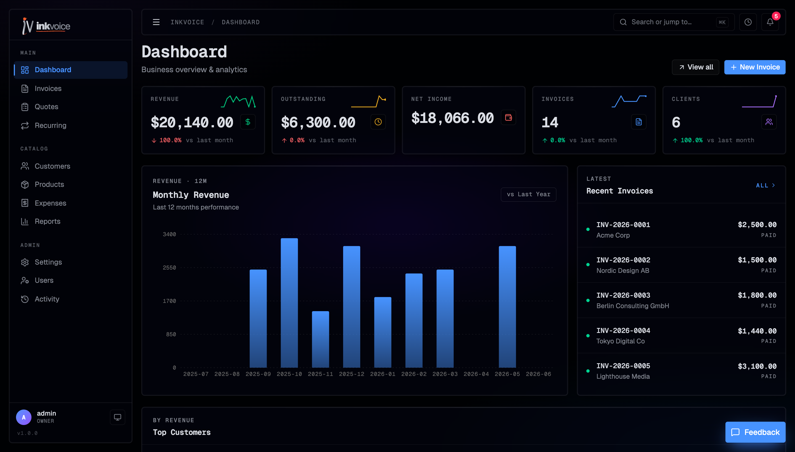

<div align="center">

# Inkvoice

### Open-source invoicing for freelancers & small teams

Create invoices, get paid online, track expenses, and **own your data** — all from a single ~50&nbsp;MB container.
A self-hostable alternative to FreshBooks, Wave, Zoho Invoice & Invoice Ninja.

[](https://github.com/pigontech/inkvoice/actions/workflows/ci.yml)
[](./LICENSE)

[](./CONTRIBUTING.md)
[](https://github.com/pigontech/inkvoice/stargazers)

**[Live Demo](https://demo.inkvoice.app) · [Inkvoice Cloud](https://cloud.inkvoice.app) · [Documentation](https://docs.inkvoice.app) · [Website](https://inkvoice.app)**



</div>

## Why Inkvoice

Inkvoice is a lightweight, **self-hosted** invoicing dashboard for people who'd rather own their billing than rent it. Send professional invoices, get paid online, keep an eye on expenses, and hand clean numbers to your accountant — without per-seat pricing or data lock-in.

- 🗄️ **Own your data** — everything lives in a single SQLite file you control.
- 📦 **One container, runs anywhere** — Docker, [Coolify](https://coolify.io), [Dokploy](https://dokploy.com); ~50–100&nbsp;MB RAM.
- ⚡ **Modern & fast** — Bun + Hono + React, no heavyweight runtime.
- 🌍 **Multi-currency, multi-user, multi-language** out of the box.
- ☁️ **Don't want to self-host?** Use the managed **[Inkvoice Cloud](https://cloud.inkvoice.app)** and skip the ops.

> Try it right now on the **[live demo](https://demo.inkvoice.app)** — no signup required.

## Features

**Invoicing**
- Full lifecycle: draft → send → paid → void, plus one-click duplicate
- Line items, discounts and multiple tax rates with auto-calculation
- Polished PDF export (headless Chrome) with customizable Mustache templates
- Public shareable links with **read receipts** — see when a client opens an invoice

**Quotes & recurring**
- Quotes you can share and convert into invoices
- Recurring invoices with automated generation on a schedule

**Get paid**
- Online card payments via **Stripe**
- Manual and partial payment tracking

**Money & books**
- **Multi-currency** with live exchange rates + base-currency consolidated reporting
- **Expense tracking** — billable expenses, receipts and categories
- Customer **account statements** (PDF per period)
- **Reports** — tax summary, A/R aging, revenue by customer & product, profit & loss, expenses by category, currency breakdown, and cash-flow forecast — every report exports to **CSV**

**Platform**
- Multi-user with **role-based permissions** and an activity log
- Built-in **i18n** (English & Turkish — easy to add more)
- **Dark mode**, fully responsive
- Single Docker container, native SQLite, tiny footprint

## Screenshots

|  |  |
| :---: | :---: |
| **Invoices** | **Invoice detail** |
|  |  |
| **Reports (Profit & Loss)** | **Customers** |
|  |  |
| **Products & services** | **Dark mode** |
|  |  |

## Quick Start

### Docker (recommended)

```bash
docker compose up -d
```

Open **[http://localhost:3000](http://localhost:3000)** and log in with `admin` / `changeme`. Change the password from the user menu right away.

### Manual (development)

```bash
bun install
bun run dev          # backend (:3000) + frontend (:5173) together
```

### Build for production

```bash
bun run build        # build the frontend
bun run start        # serve API + static frontend on :3000
```

## Self-Hosting

[](#plain-docker)
[](#coolify)
[](#dokploy)

Inkvoice ships as a single container — point any Docker host at the bundled `Dockerfile`, expose port `3000`, and mount a volume on `/app/data` so the SQLite database survives redeploys.

### Coolify

1. **New resource → Public Repository** → paste this repo's URL.
2. **Build pack:** Dockerfile (the repo root `Dockerfile`).
3. **Port:** `3000`.
4. **Persistent storage:** add a volume on `/app/data` — without it, every deploy wipes the database.
5. **Environment:** set at least `JWT_SECRET` (≥ 32 chars), `ADMIN_PASS`, and `COOKIE_SECURE=true`.
6. **Domain:** attach one and Coolify issues a Let's Encrypt cert; then set `ENABLE_HSTS=true`.
7. **Health check:** point it at `/health`.

### Dokploy

Same shape as Coolify — create a Docker service from this repo, expose port `3000`, mount a volume on `/app/data`, and set `JWT_SECRET` + `ADMIN_PASS`.

### Plain Docker

```bash
docker build -t inkvoice .
docker run -d \
  --name inkvoice \
  -p 3000:3000 \
  -v inkvoice-data:/app/data \
  -e JWT_SECRET="$(openssl rand -base64 48)" \
  -e ADMIN_PASS="change-me-please" \
  -e COOKIE_SECURE=true \
  -e ENABLE_HSTS=true \
  inkvoice
```

## Configuration

Copy `.env.example` to `.env` to bootstrap a local config. Most runtime knobs (currency, locale, invoice number pattern, email templates, etc.) live on the in-app **Settings** page — environment variables are reserved for deploy-time concerns (auth, ports, secrets).

### Environment Variables

| Variable                  | Required | Default               | Description                                                          |
| ------------------------- | -------- | --------------------- | -------------------------------------------------------------------- |
| `ADMIN_USER`              | yes      | `admin`               | Initial admin username (created on first boot if no users exist)     |
| `ADMIN_PASS`              | yes      | `changeme`            | Initial admin password                                               |
| `JWT_SECRET`              | yes      | (dev-only fallback)   | JWT signing secret — must be ≥ 32 chars in production                |
| `DATABASE_PATH`           | no       | `./data/invoice.db`   | SQLite database file path                                            |
| `PORT`                    | no       | `3000`                | HTTP listen port                                                     |
| `HOST`                    | no       | `0.0.0.0`             | Bind address                                                         |
| `SESSION_TTL`             | no       | `3600`                | JWT lifetime in seconds                                              |
| `COOKIE_SECURE`           | no       | `true`                | Set to `false` for plain-HTTP development                            |
| `ENABLE_HSTS`             | no       | `false`               | Send HSTS header (set to `true` behind HTTPS)                        |
| `RATE_LIMIT_ENABLED`      | no       | `true`                | Enable login rate limiting                                           |
| `RATE_LIMIT_MAX_ATTEMPTS` | no       | `5`                   | Max failed logins per window                                         |
| `RATE_LIMIT_WINDOW`       | no       | `900`                 | Rate-limit window in seconds                                         |
| `ALLOWED_ORIGINS`         | no       | `localhost:5173,3000` | Comma-separated CORS allow-list                                      |
| `CHROME_PATH`             | no       | (auto-detected)       | Override Chrome/Chromium binary path for PDF rendering               |
| `SMTP_HOST`               | no       | —                     | SMTP host. Set this group to enable invoice email sending            |
| `SMTP_PORT`               | no       | `587`                 | SMTP port                                                            |
| `SMTP_USER`               | no       | —                     | SMTP username                                                        |
| `SMTP_PASS`               | no       | —                     | SMTP password                                                        |
| `SMTP_FROM`               | no       | —                     | Sender address                                                       |
| `SMTP_SECURE`             | no       | `false`               | Use TLS (set `true` for port 465)                                    |
| `STRIPE_SECRET_KEY`       | no       | —                     | Stripe secret key (`sk_…`) — enables online payments                 |
| `STRIPE_PUBLISHABLE_KEY`  | no       | —                     | Stripe publishable key (`pk_…`)                                      |
| `STRIPE_WEBHOOK_SECRET`   | no       | —                     | Stripe webhook signing secret (`whsec_…`)                            |
| `DEMO_MODE`               | no       | `false`               | Periodically reset DB to seeded demo data (for public demo deploys)  |
| `DEMO_RESET_INTERVAL`     | no       | `86400000`            | Demo reset interval in ms (default 24h)                              |

## Tech Stack

| Layer | Choice |
| --- | --- |
| Runtime | **Bun** |
| Backend | **Hono** + **SQLite** (`bun:sqlite`), **Zod** validation, JWT auth |
| Frontend | **React 19** + **Vite**, **Tailwind CSS** + shadcn/ui |
| PDF | Headless Chrome + **Mustache** templates |
| Packaging | Single **Docker** container serving API + static SPA |

## Documentation

- [Architecture overview](./docs/ARCHITECTURE.md) — components, data flow, where to add features.
- [Template variables](./docs/TEMPLATE_VARIABLES.md) — every `{{token}}` available in invoice/quote/email templates.
- [Contributing](./CONTRIBUTING.md) — setup, conventions, and PR checklist.
- Full docs: **[docs.inkvoice.app](https://docs.inkvoice.app)**

## Contributing

PRs are welcome! Please read [CONTRIBUTING.md](./CONTRIBUTING.md) for setup and conventions. Found a bug or have an idea? [Open an issue](https://github.com/pigontech/inkvoice/issues).

## License

[MIT](./LICENSE)
